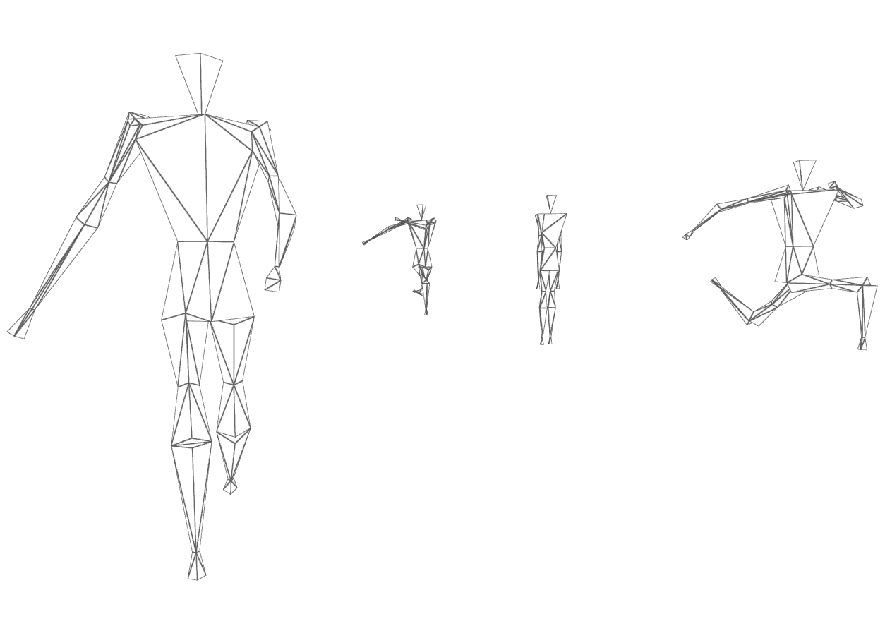
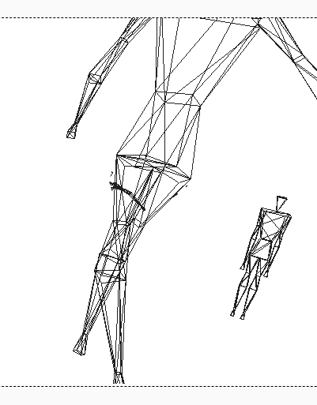
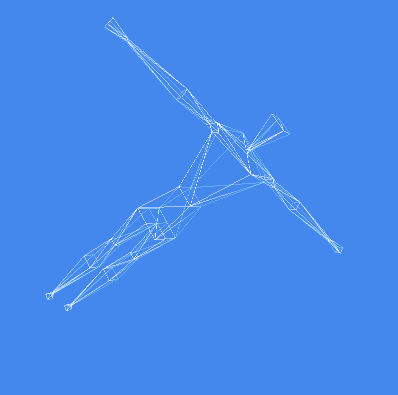

# Andre's Creative Coding Archive

I did illustrations, planning, icons, etc. for websites, promo material, GUIs 
and so on usually directly in dedicated graphics programs where programming played no role.
However, there a few of my source codes that I still found on my computer
and were part or should have been part of some private graphics projects.

- [Runner](#runner-2021)
- [Collage](#collage-2018)
- [Network Racks](#network-racks-2013)

## [Runner (2021)](./runner/)

OpenSCAD code to draw running figure wireframes.
Inspired by a similar CPC6128 home computer program from my childhood in the early 1990s, 
whose name I unfortunately no longer remember (Runner Simulator?)

[Source Code](./runner/)

## [Collage (2018)](./collage/)

Javascript/CSS to generate collages from some given images.
Currently it reproduces the style of Jelle Marten's "[In The Quivering Forest](https://www.google.com/search?q=Jelle+Martens+%22In+The+Quivering+Forest%22&tbm=isch)" only. 
It creates and composes SVG _patterns_ instead of drawing on a HTML5 canvas.

Sample Images TODO

[Source Code](./collage/)

## [Network Racks (2013)](https://github.com/andre-st/network-racks)

Planning a rack enclosure cabinet with network gear using a 3D model, 
which helps visualize space problems, e.g., in the rear. Also OpenSCAD learning opportunity.

[Github Repository](https://github.com/andre-st/network-racks)

## To be continued ...

