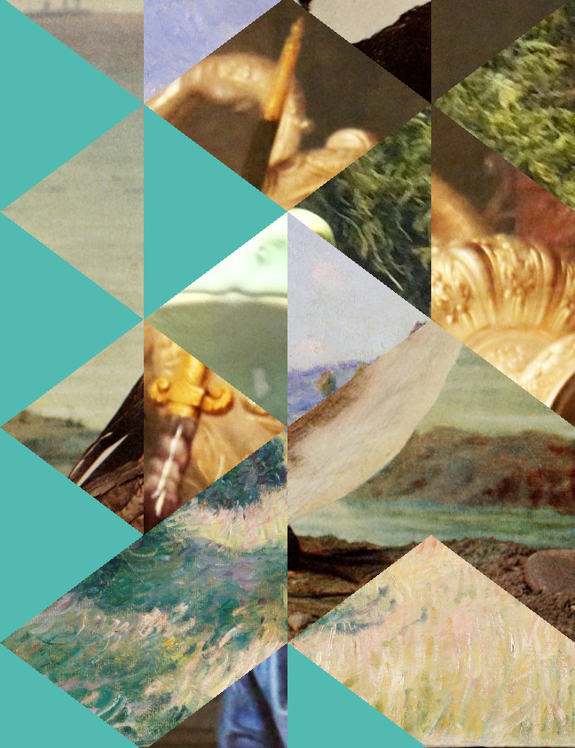
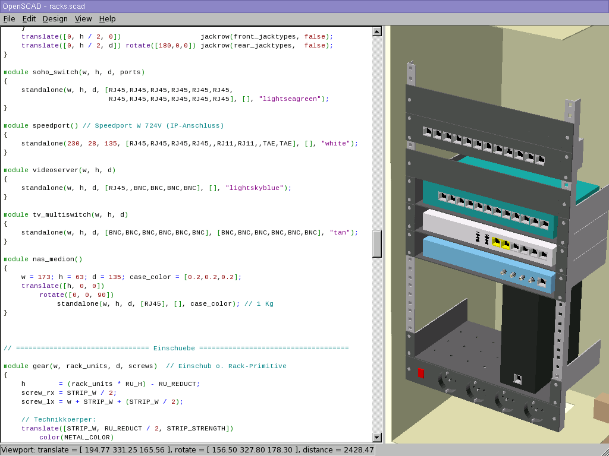

# Andre's Creative Coding Archive

I usually create illustrations, icons etc for websites and GUIs or promotional material
in dedicated graphics programs where programming played no role.
However, there are private source codes that I still found on my computer
and that were part or should have been part of some graphics projects.

- [Runner](#runner-2021)
- [Collage](#collage-2018)
- [Network Racks](#network-racks-2013)

## [Runner (2021)](./runner/)

OpenSCAD code to draw running figure wireframes composed from triangles only.
Inspired by a similar CPC 6128 home computer program from my childhood in the early 1990s, 
whose name I unfortunately no longer remember (Runner Simulator?). 
It ran in mode 2. I was fascinated at the time by how little code was actually used to realize something 
like this and was therefore invited to experiment with it.

[Source Code](./runner/)

## [Collage (2018)](./collage/)

Javascript/CSS to generate random collages from some given images.
Currently it reproduces the style of Jelle Marten's "[In The Quivering Forest](https://www.google.com/search?q=Jelle+Martens+%22In+The+Quivering+Forest%22&tbm=isch)" only. 
It creates and composes SVG _patterns_ instead of drawing on a HTML5 canvas.

<small>Source Image Attributions (Wikimedia Commons):  
Salwa Farwaneh (CC), Meiffren Conte (PD), Alfred Sisley (PD), Internet Archive Book Images</small>

[Source Code](./collage/)

## [Network Racks (2013)](https://github.com/andre-st/network-racks)

Planning a rack enclosure cabinet with network gear using a 3D model, 
which helps visualize space problems, e.g., in the rear. 

When a friend and colleague was building a house in 2013, 
I was asked to take on the network planning (star cabling with a central 19" cabinet),
and on this occasion I combined the cabinet planning with learning OpenSCAD. 

[OpenSCAD](http://www.openscad.org/) creates rotatable and zoomable, highly configurable solid-state models (Solid CAD) 
based on text descriptions that are similar to declarative or functional programming. 
All expressions are evaluated at compile time; there are only constants. 
A [CSG tree](https://de.wikipedia.org/wiki/Constructive_Solid_Geometry) and its graphical representation are created.

We acquired some low-end business-grade technology from bankruptcy sales, 
e.g., a managed switch with (port-based) VLAN, 
relatively high backplane capacity (at least as high as the throughput of all ports combined), etc. 
Hint: always google the reset or cracking options before buying.

[Source Code](./netrack/)

## To be continued ...

